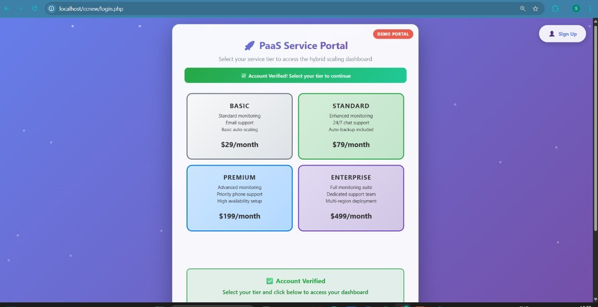
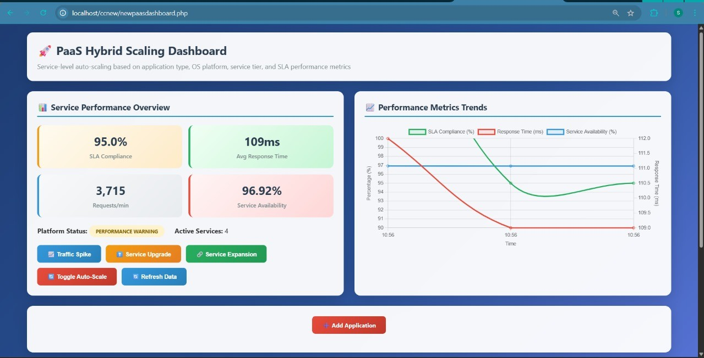
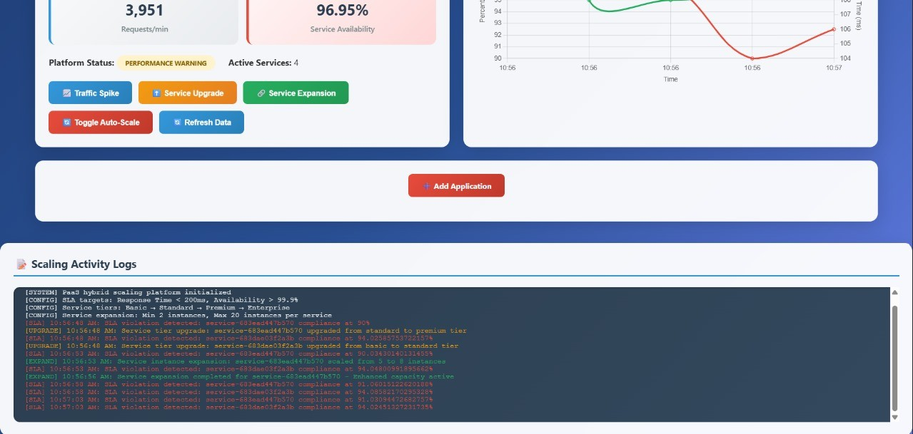

# 🌐 PAAS-Simulation

A *Platform-as-a-Service (PaaS)* simulation project showcasing cloud architecture with interactive dashboards and cloud service management.  

---

## 📖 About

This project demonstrates a *PaaS simulation* using PHP and HTML. It includes features like user authentication, dashboards, and cloud service interaction.

Built for learning and showcasing *cloud computing concepts*.  
Lightweight and easy to deploy.  

---

## 🛠 Features
- *User Login & Registration*
- *PaaS Dashboard*
- *Cloud Services Simulation*
- *Responsive UI*

---




## Getting Started

### Clone the Repository
```bash
git clone https://github.com/Preethigapalanikumar/PAAS-Simulation.git
cd PAAS-Simulation
